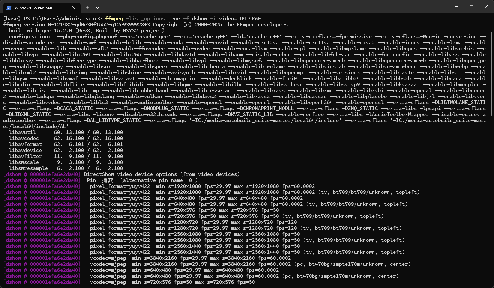
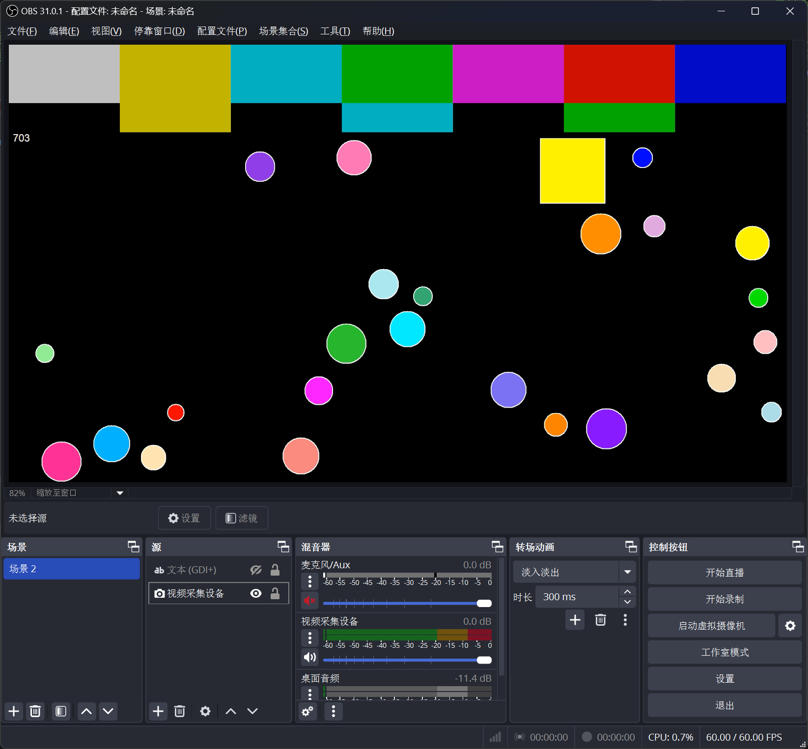
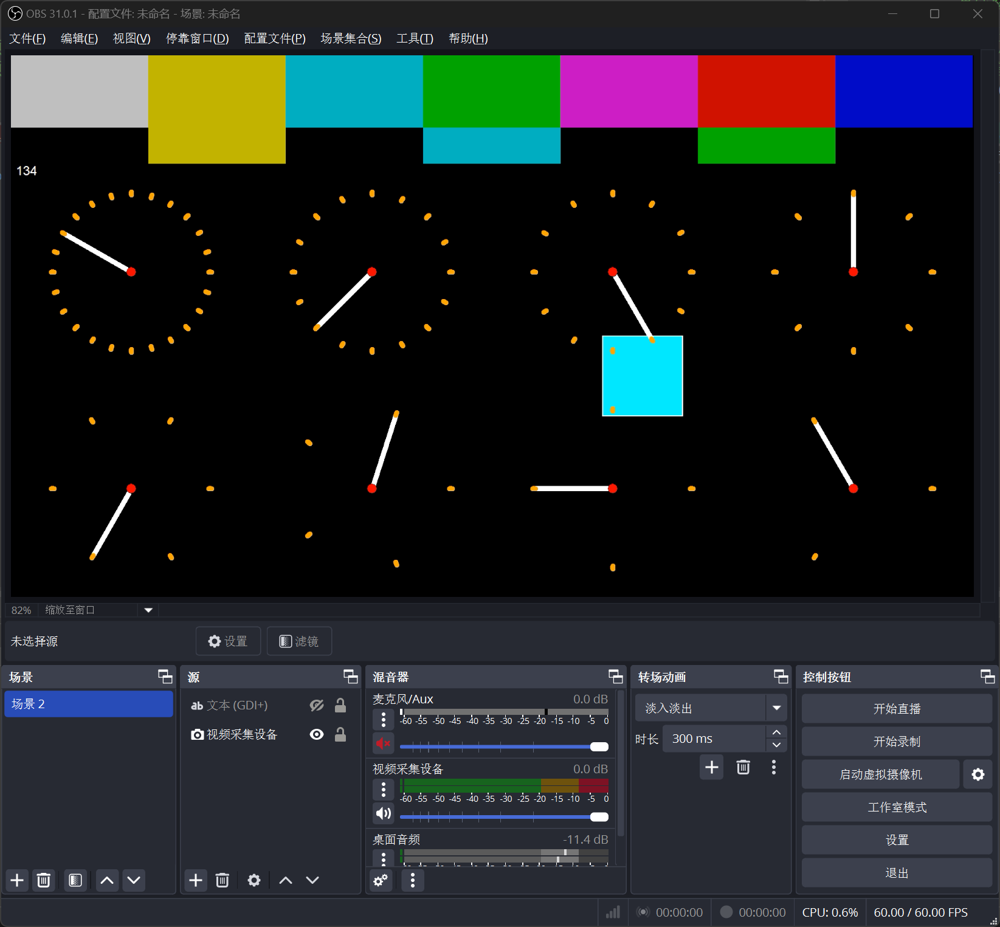
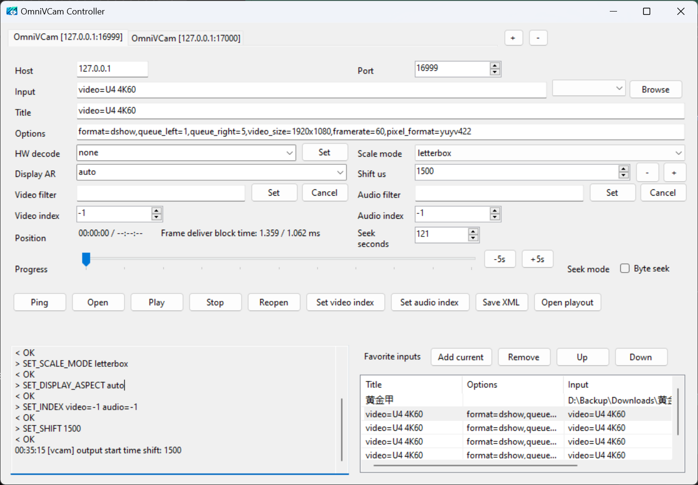
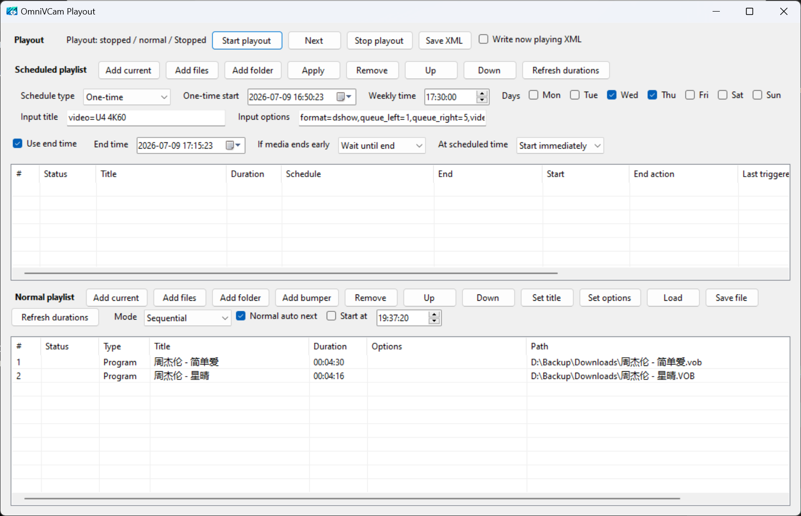

# OmniVCam Virtual Cam

[简体中文](README.zh-CN.md)

OmniVCam is a Windows DirectShow virtual camera. It can output local media files, DirectShow capture devices, OBS virtual-camera shared memory, and built-in test cards as a camera device. `OmniVCamController.exe` is the WinForms controller used to play inputs, tune playback options, and run playout playlists.

The project contains two main parts:

- `OmniVCam`: the DirectShow virtual camera DLL. It handles decoding, filtering, A/V sync, and output.
- `OmniVCamController`: the controller UI. It connects to the virtual camera TCP control server, default `127.0.0.1:16999`.

## Features

- Play local media files and arbitrary FFmpeg inputs.
- Play DirectShow devices such as capture cards or OBS Virtual Camera.
- Read OBS virtual camera shared-memory input with `<OBSVCAM>`.
- Built-in test cards: `<TESTCARD>` and `<TESTCARD2>`.
- Per-input options such as `seek_time`, stream indexes, filters, queue settings, and input format.
- Manual playback controls: play/pause toggle, stop, reopen, seek, byte seek, progress drag, filters, display aspect, scale mode, and output time shift.
- Runtime changes for scale mode and display aspect during playback.
- Favorite inputs list for reusable input/options pairs.
- Multiple connection tabs, each with independent host/port, input settings, playlists, and favorites.
- Controller UI localization through standard `.resx` resources, currently English, Simplified Chinese, and Traditional Chinese.
- Playout window with separate scheduled and normal playlists.
- One-time and weekly scheduled playlist items with editable title, options, start/end behavior, and live Apply.
- Bumper items in normal playlist for interstitial content.
- Drag-and-drop support: drop files onto the input field or playlist.
- Built-in log viewer displaying FFmpeg log messages forwarded via TCP.
- Frame deliver block-time stats displayed in the position area.
- Optional now-playing XML output for vMix and other external tools.
- Automatic saving of UI settings, playlists, scheduled playlist, and favorite inputs to `OmniVCamController.xml`.

## Install

1. Copy the release files to a fixed directory, for example `D:\OmniVCam`. Keep `OmniVCam.dll`, FFmpeg DLLs, config files, and the controller together.
2. Register the virtual camera DLL from an elevated command prompt:

   ```bat
   cd /d D:\OmniVCam
   regsvr32 OmniVCam.dll
   ```

3. Select `OmniVCam Virtual Camera` in OBS, vMix, conferencing software, or other camera clients.

To unregister:

```bat
cd /d D:\OmniVCam
regsvr32 /u OmniVCam.dll
```

## Multiple Instances

OmniVCam supports up to 4 simultaneous virtual camera instances. Each instance has its own CLSID and reads its own `config.ini` via an environment variable:

| Instance | Environment Variable | Config Path Example |
| --- | --- | --- |
| OmniVCam | `OMNI_VCAM_CONFIG` | `D:\OmniVCam\config.ini` |
| OmniVCam2 | `OMNI_VCAM_CONFIG2` | `D:\OmniVCam2\config.ini` |
| OmniVCam3 | `OMNI_VCAM_CONFIG3` | `D:\OmniVCam3\config.ini` |
| OmniVCam4 | `OMNI_VCAM_CONFIG4` | `D:\OmniVCam4\config.ini` |

To run multiple instances, copy the DLL and config files into separate directories, set each environment variable to point to the corresponding `config.ini`, and register each DLL instance. Each instance exposes a distinct camera device name (e.g. `OmniVCam Virtual Camera`, `OmniVCam2 Virtual Camera`, etc.).

## Controller Basics

Run `OmniVCamController.exe`. The default target is `127.0.0.1:16999`; the port must match `tcp_port` in `OmniVCam/config.ini`.

### Connection Tabs

The controller supports **multiple connection tabs**. Each tab maintains its own host, port, input settings, playlists, favorites, and log text. Use the `+` button to add a tab and the `-` button to remove one. Tab titles display the connection endpoint.

Main controls:

- `Host` / `Port`: TCP control endpoint.
- `Input`: the input to play. It can be a file path, URL, DirectShow input, or a special input such as `<TESTCARD>`, `<TESTCARD2>`, or `<OBSVCAM>`. A quick-select dropdown provides quick access to special inputs.
- `Title`: display title used by playlists and now-playing XML. If blank, the controller derives a title from the input.
- `Options`: FFmpeg/open-input options for the current input, for example `seek_time=14,video_filter='bwdif=1'`.
- `Browse`: select a local media file.
- `Open`: open/play the current `Input` with current `Options`.
- `Play`: play the current `Input`, or toggle **Pause/Play** while playback is active or paused.
- `Stop`: stop playback and stop playout.
- `Reopen`: reopen the current input.
- `Ping`: test the TCP connection.
- `Video filter` / `Audio filter`: set or cancel global filters.
- `HW decode`: set hardware decode mode: `none`, `dxva2`, `d3d11va`, `cuda`, or `qsv`.
- `Video index` / `Audio index`: select input stream indexes. `-1` means auto.
- `Seek seconds`: seek by absolute seconds.
- `Progress`: drag to seek. With `Byte seek` enabled, the progress bar seeks by file byte percentage. Quick `-5s` / `+5s` buttons are available beside the progress bar.
- `Shift us`: output frame timing shift in microseconds.
- `Scale mode`: output scaling mode (`letterbox`, `fill`). Can be changed at runtime.
- `Display AR`: display aspect ratio (`auto`, `16:9`, `4:3`, `1:1`). Can be changed at runtime.
- `Open playout`: open the separate playout window.
- `Language`: select Auto, English, Simplified Chinese, or Traditional Chinese. Restart the controller after changing this setting.

### Log Viewer

The main window includes a **log viewer** panel on the left side that displays FFmpeg log messages forwarded from the virtual camera instance over TCP. Log output is auto-scrolling and capped at a maximum line count. Each connection tab preserves its own log text independently.

### Drag and Drop

- Drag files onto the **Input** field to load them for playback.
- Drag files onto the **Normal playlist** or **Scheduled playlist** to add them as items.

## Favorite Inputs

Favorite inputs are shown in the right half of the main window.

- `Add current`: add current `Input`, `Title`, and `Options`.
- `Remove`, `Up`, `Down`: edit list order.
- Single-click: load the favorite into the main input fields.
- Double-click: play the favorite immediately.

## Playout Window

Click `Open playout` in the main window. The playout window contains two lists:

- `Scheduled playlist`: timed playout items.
- `Normal playlist`: fallback/continuous playlist.

Closing the playout window hides it. Closing the main controller exits the application.

Top controls:

- `Start playout`: start playout scheduling. The playout timer only runs while playout is started.
- `Next`: manually play the next normal playlist item. In `Random` mode it chooses a random item.
- `Stop playout`: stop playout, stop playback, and clear scheduled trigger marks.
- `Save XML`: save controller settings and both playlists to `OmniVCamController.xml`.
- `Write now playing XML`: enable or disable now-playing XML output.

## Scheduled Playlist

Scheduled playlist columns:

- `Status`: `Waiting`, `In window`, `Blocked`, `Playing`, `Ended`, `Error`, etc.
- `Title`: item title.
- `Duration`: item duration. Unknown duration is shown as `--:--:--`.
- `Schedule`: one-time date/time or weekly days/time.
- `End`: explicit end time, or `Next schedule` when no end time is set.
- `Start`: start behavior.
- `End action`: behavior if media ends before the end time.
- `Last triggered`: last schedule-window start that triggered this item. Stop clears it.
- `Path`: input path/URL/device/special input.

Scheduled item controls:

- `Add current`: add current main `Input` as a scheduled item.
- `Add files`: add one or more media files as scheduled items.
- `Add folder`: recursively add media files from a folder.
- `Apply`: write the current scheduled settings into the selected scheduled item. This also works while the item is playing.
- `Remove`, `Up`, `Down`: edit list order.
- `Refresh durations`: probe durations for scheduled items only.

Scheduled settings:

- `Schedule type`: `One-time` or `Weekly`.
- `One-time start`: full date and time for one-time items.
- `Weekly time`: time of day for weekly items.
- `Days`: weekly day mask.
- `Input title`: title used for scheduled items. If blank, it falls back to main `Title`, then input-derived title.
- `Input options`: options used for scheduled items. If blank, it falls back to main `Options`.
- `Use end time`: enable explicit end time.
- `End time`: for one-time items this is date/time; for weekly items only the time of day is meaningful.
- `If media ends early`:
  - `Replay until end`: replay the same item until the end time.
  - `Wait until end`: do not play another item until the end time.
  - `Continue immediately`: leave the scheduled item immediately.
- `At scheduled time`:
  - `Start immediately`: cut in when this task becomes active, including over another scheduled item if this window starts later.
  - `Wait current item`: wait while another item is playing; the scheduler rechecks every tick.

Scheduling behavior:

- The scheduler uses time windows, not a one-second exact trigger. If the PC stalls for several seconds, a task can still start as long as current time is inside its window.
- With `Use end time`, the window is `start -> end`.
- Without `Use end time`, the window is `start -> next scheduled task start`. If no next task exists, the window is open-ended.
- A later `Start immediately` scheduled task can cut into the currently playing scheduled task.
- `Stop playout` clears all `Last triggered` marks, so restarting playout can trigger tasks that are still inside their windows.

## Normal Playlist

Normal playlist controls:

- `Add current`: add current main `Input` to the normal playlist. This supports arbitrary input, not only files.
- `Add files`: add media files.
- `Add folder`: recursively add media files from a folder.
- `Add bumper`: add a file marked as `Bumper`. Bumpers serve as interstitial content between normal playlist items during playout.
- `Remove`, `Up`, `Down`: edit list order.
- `Set title`: apply the main `Title` field to selected normal items.
- `Set options`: apply the playout `Input options` field to selected normal items.
- `Load` / `Save file`: load or save `.ovcpl` playlist files.
- `Refresh durations`: probe durations for normal items only.
- `Mode`: `Sequential` or `Random`.
- `Normal auto next`: when enabled, normal playlist advances on ended/error or known duration reached.
- `Start at`: optional legacy time-of-day start for normal playlist start.

Duration is not probed automatically when adding or loading items. Click `Refresh durations` when durations are needed.

When scheduled playback finishes, the controller returns to the normal playlist if it has items. If no normal items exist, playback remains stopped/ended.

## Now-Playing XML

When `Write now playing XML` is checked, the controller writes an XML file beside the controller executable. With a single connection tab the file is:

```text
OmniVCamNowPlaying.xml
```

With multiple connection tabs, each tab writes its own file named by host and port:

```text
OmniVCamNowPlaying-{host}-{port}.xml
```

For example `OmniVCamNowPlaying-127.0.0.1-16999.xml`.

The file is updated from `STATUS` polling and on stop. It can be imported by tools such as vMix.

Example:

```xml
<NowPlaying>
  <Title>Program title</Title>
  <Path>D:\media\program.mp4</Path>
  <PositionSeconds>123</PositionSeconds>
  <Position>00:02:03</Position>
  <DurationSeconds>3600</DurationSeconds>
  <Duration>01:00:00</Duration>
  <Status>Playing</Status>
</NowPlaying>
```

Uncheck `Write now playing XML` to stop writing this file. Existing XML files are not deleted automatically.

## Common Inputs And Options

`Options` are parsed as FFmpeg open-input options plus OmniVCam-specific options. Multiple options are separated by commas.

| Use case | Input | Options |
| --- | --- | --- |
| OBS shared-memory input | `<OBSVCAM>` | `queue_left=1,queue_right=5` |
| Test card 1 | `<TESTCARD>` | empty |
| Test card 2 | `<TESTCARD2>` | empty |
| Play file and seek to 14 seconds | `D:\example.mp4` | `seek_time=14` |
| Play file with filters/indexes | `D:\tv.ts` | `video_filter='bwdif=1',audio_filter='loudnorm',video_index=0,audio_index=1` |
| OBS Virtual Camera device | `video=OBS Virtual Camera` | `format=dshow,rtbufsize=1G,queue_left=5,queue_right=20` |
| Capture card 1080p60 YUY2 | `video=U4 4K60` | `format=dshow,rtbufsize=1G,queue_left=1,queue_right=5,video_size=1920x1080,framerate=60,pixel_format=yuyv422` |
| Capture card 1080p120 MJPEG | `video=U4 4K60` | `format=dshow,rtbufsize=1G,queue_left=1,queue_right=10,video_size=1920x1080,framerate=120,vcodec=mjpeg` |

Supported OmniVCam-specific options include:

- `video_filter`: per-input video filter.
- `audio_filter`: per-input audio filter.
- `video_index` / `audio_index`: input stream indexes.
- `seek_time`: seek after opening input.
- `queue_left` / `queue_right` / `queue_center`: frame queue tuning.
- `probesize` / `analyzeduration`: FFmpeg probing options.
- `format`: input format, for example `dshow`.
- `vcodec` / `acodec` / `scodec` / `dcodec`: decoder selection.

To list DirectShow capture formats with FFmpeg:

```bat
ffmpeg -list_options true -f dshow -i video="U4 4K60"
```

Example screenshot:



## Test Cards

`<TESTCARD>` shows a square and moving circles. It is useful for checking dropped frames and motion continuity.



`<TESTCARD2>` shows a square and rotating lines. It is useful for checking motion continuity and rotational line loss.



## Controller





## Configuration Files

Controller state is saved to:

```text
OmniVCamController.xml
```

This file stores controller settings, favorite inputs, normal playlist, scheduled playlist, and now-playing XML output preference.
It also stores the controller UI language in the root `uiCulture` attribute when a language is selected explicitly.

`OmniVCam/config.ini` is read by the virtual camera instance. Common keys include:

- `hw_decode`: default hardware decode mode.
- `tcp_port`: TCP control port, default `16999`.
- `log_level`: FFmpeg log level.
- `video_frame_buffer` / `audio_frame_buffer`: output frame buffering.
- `packet_queue_size`: packet queue size.
- `timeout`: input timeout in microseconds.
- `use_fixed_frame_interval`: usually `1` for OBS compatibility.
- `ajust_start_time_if_delay_over`: output timing correction threshold.
- `av_max_offset_time`: max A/V timestamp offset in microseconds.

Restart the host application or reload the virtual camera instance after changing `config.ini`.

## TCP Control Protocol

The virtual camera accepts line-based TCP commands. Default port: `16999`.

Supported commands include:

- `PING`: returns `OK PONG`.
- `STATUS`: returns `seconds`, `duration`, `size`, `state`, `scale_mode`, `display_aspect`, `input`, `deliver_ns`, `deliver_avg_ns`, and `controller_connected`.
- `DURATION <input>[\toptions]`: probe input duration.
- `PLAY <input>[\toptions]`: play input.
- `PAUSE`: pause output without closing the input.
- `RESUME`: resume paused output.
- `STOP`: stop playback.
- `REOPEN`: reopen current input.
- `SET_FILTER <filter>`: set/cancel global video filter.
- `SET_AUDIO_FILTER <filter>`: set/cancel global audio filter.
- `SET_HW_DECODE <none|dxva2|d3d11va|cuda|qsv>`: set hardware decode.
- `SET_SCALE_MODE <letterbox|fill|stretch|fit|keep_aspect|fullscreen>`: set output scale mode at runtime.
- `SET_DISPLAY_ASPECT <auto|num:den>`: set display aspect ratio at runtime.
- `SET_INDEX video=<n> audio=<n>`: set stream indexes.
- `SET_SHIFT <microseconds>`: set output timing shift.
- `SEEK <seconds>`: seek by seconds.
- `SEEK_BYTE_PERCENT <0-10000>`: seek by byte percentage; `10000` means 100%.

## Build

Solution: `OmniVCam.sln`.

- `OmniVCam`: C/C++ DirectShow DLL, Visual Studio 2022 / v143, supports `Win32` and `x64`.
- `OmniVCamController`: C# WinForms application targeting .NET Framework 4.8, `AnyCPU`.

Dependency conventions:

- `deps/include`: DirectShow Base Classes headers.
- `deps/lib/x86` and `deps/lib/x64`: DirectShow Base Classes libraries.
- `ffmpeg_deps/include` and `ffmpeg_deps/lib`: FFmpeg development files when building the native DLL.

A release package must include the virtual camera DLL, required FFmpeg runtime DLLs, `config.ini`, and `OmniVCamController.exe`.
